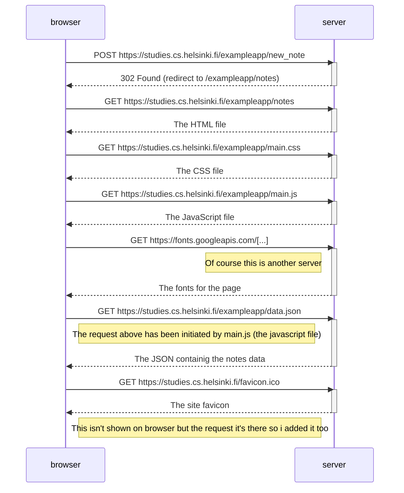

<!-- ::: mermaid block is for a vscode extension to recognise mermaid and generate a preview (https://marketplace.visualstudio.com/items?itemName=bierner.markdown-mermaid) -->

```mermaid

sequenceDiagram
participant browser
participant server

browser->>server: POST https://studies.cs.helsinki.fi/exampleapp/new_note
activate server
server-->>browser: 302 Found (redirect to /exampleapp/notes)
deactivate server

browser->>server: GET https://studies.cs.helsinki.fi/exampleapp/notes
activate server
server-->>browser: The HTML file
deactivate server

browser->>server: GET https://studies.cs.helsinki.fi/exampleapp/main.css
activate server
server-->>browser: The CSS file
deactivate server

browser->>server: GET https://studies.cs.helsinki.fi/exampleapp/main.js
activate server
server-->>browser: The JavaScript file
deactivate server

browser->>server: GET https://fonts.googleapis.com/[...]
activate server
note left of server: Of course this is another server
server-->>browser: The fonts for the page
deactivate server

browser->>server: GET https://studies.cs.helsinki.fi/exampleapp/data.json
activate server
note right of browser: The request above has been initiated by main.js (the javascript file)
server-->>browser: The JSON containig the notes data
deactivate server

browser->>server: GET https://studies.cs.helsinki.fi/favicon.ico
activate server
server-->>browser: The site favicon
deactivate server

note right of browser: This isn't shown on browser but the request it's there so i added it too


```
