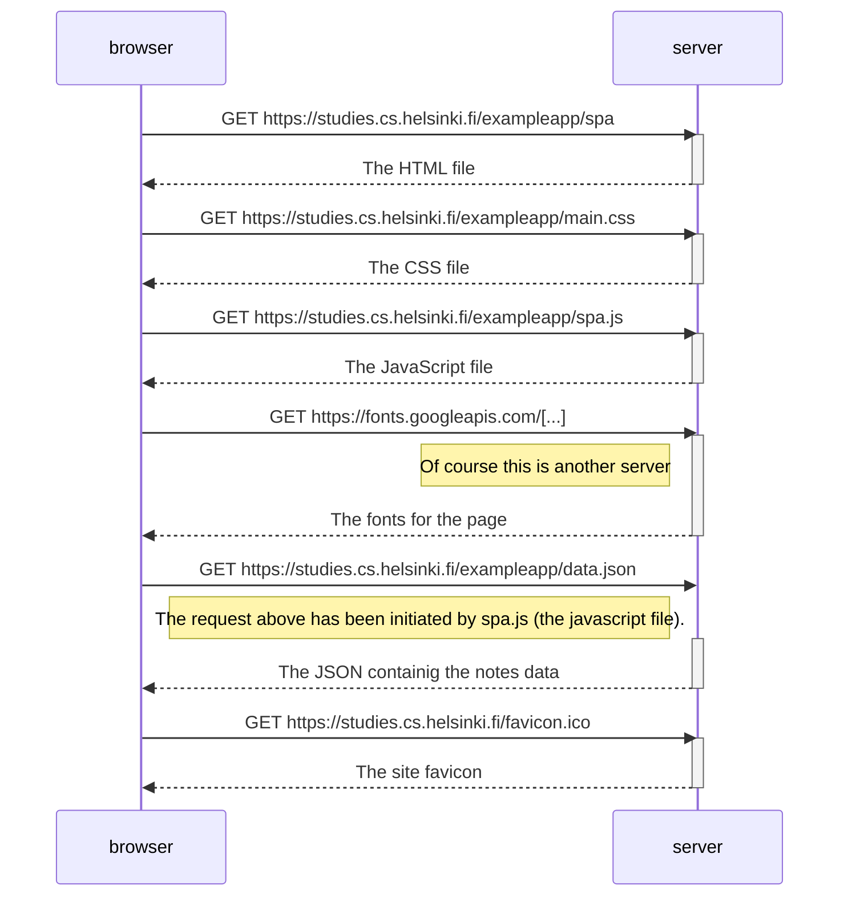

```mermaid

sequenceDiagram
participant browser
participant server

browser->>server: GET https://studies.cs.helsinki.fi/exampleapp/spa
activate server
server-->>browser: The HTML file
deactivate server

browser->>server: GET https://studies.cs.helsinki.fi/exampleapp/main.css
activate server
server-->>browser: The CSS file
deactivate server

browser->>server: GET https://studies.cs.helsinki.fi/exampleapp/spa.js
activate server
server-->>browser: The JavaScript file
deactivate server

browser->>server: GET https://fonts.googleapis.com/[...]
activate server
note left of server: Of course this is another server
server-->>browser: The fonts for the page
deactivate server

browser->>server: GET https://studies.cs.helsinki.fi/exampleapp/data.json
note right of browser: The request above has been initiated by spa.js (the javascript file).
activate server
server-->>browser: The JSON containig the notes data
deactivate server

browser->>server: GET https://studies.cs.helsinki.fi/favicon.ico
activate server
server-->>browser: The site favicon
deactivate server

```
